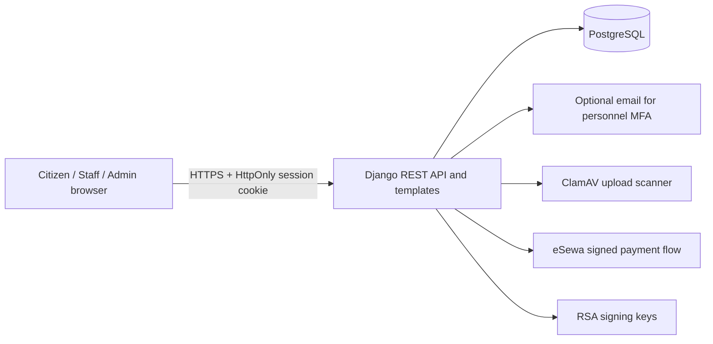

# Nepal e-Passport Workflow Demo

An academic Django application that demonstrates citizen registration, passport application preparation, document review, payment verification, biometric approval, digital signing, and queue processing.

> This repository is not an official Government of Nepal service and cannot issue a legally valid passport. Use synthetic test data only.

## Architecture



The authoritative workflow rules live in `backend/passport/workflow_service.py`. Views, serializers, model step presentation, and download authorization consume the same facts so the UI cannot disagree with the backend gate.

## Local setup

Requirements: Python 3.13, PostgreSQL, and Node.js only for JavaScript syntax checks.

1. Create and activate a virtual environment.
2. Install packages with `pip install -r backend/requirements.txt`.
3. Copy `.env.example` to `.env` and replace every placeholder. Citizen registration uses a required, validated, unique Nepali mobile number and does not require email delivery. For local development, keep `DJANGO_DEBUG=true`, `MALWARE_SCAN_ENABLED=false`, and `PERSONNEL_MFA_REQUIRED=false`.
4. Create the PostgreSQL database and user named in `.env`.
5. Set `DB_MIGRATION_USER` to the owner of the existing Django tables. Run `python manage.py migrate` and enter that role's password at the secure prompt, or set `DB_MIGRATION_PASSWORD` in the ignored `.env` file for non-interactive deployment. Only migration commands use the owner account; the web application continues using restricted `DB_USER` credentials.
6. Run `python manage.py runserver` and open `http://127.0.0.1:8000/`.

For an isolated local stack, run `docker compose up --build`. The Compose file is deliberately configured as a demonstration environment, not production.

## Workflow

1. Citizen registration with validated, unique email and Nepali mobile fields.
2. Application submission and private UUID tracking reference.
3. Identity document and passport-photo upload.
4. Signed, server-verified eSewa payment.
5. Staff inspection and document decisions.
6. Biometrics verification.
7. RSA-PSS digital signature.
8. Staff queue processing.
9. Transaction-locked sequential passport-number allocation when processing completes.
10. Final PDF availability only when every authoritative gate is complete.

Issued passport numbers use the format `NP0000001`, `NP0000002`, and so on. They are independent of application IDs. Allocation and queue completion share one database transaction, so a failed completion rolls back the number instead of creating a gap.

Public tracking requires both the unguessable reference and the applicant's date of birth and is rate-limited. Sequential application and queue IDs are not accepted.

## Security model

- Browser authentication uses `HttpOnly`, `SameSite` cookies; unsafe requests also require a CSRF token.
- Staff and administrator MFA is required by default when `DJANGO_DEBUG=false`.
- A nonce-based Content Security Policy restricts scripts, styles, frames, forms, and network connections.
- Passwords and one-time codes are hashed. Login attempts are throttled and locked after repeated failures.
- Uploads are limited by extension, signature, MIME type, size, dimensions, active PDF content, and configurable ClamAV scanning.
- Payment callbacks require a valid signature, exact amount, successful status, and unique transaction ID; valid retries are idempotent.
- Passport signatures bind application, applicant, payment, and verified-document hashes using RSA-PSS SHA-256.
- Uploaded media, `.env`, signing keys, caches, and generated static files are excluded from version control and Docker build context.

Bearer authentication remains supported for deliberate API integrations, but browser JavaScript never receives or stores the bearer token.

## Tests and checks

Run the safe in-memory suite:

```text
python manage.py test passport --settings=config.test_settings --verbosity 2
python manage.py check --settings=config.test_settings
node --check frontend/js/api.js
node --check frontend/js/auth.js
node --check frontend/js/i18n.js
node --check frontend/js/workflow.js
```

CI also runs the real migration chain against PostgreSQL. Coverage includes workflow completion, role isolation, document decisions, registration validation, tracking privacy, cookie/CSRF behavior, personnel MFA, signed webhook idempotency, signature tampering, upload validation, and CSP output.

## Production checklist

- Start from `.env.example`; use a secrets manager rather than committing `.env`.
- Set `DJANGO_DEBUG=false`, real hosts and trusted HTTPS origins, a long random Django key, database credentials, production eSewa credentials, and mounted RSA key files. Configure email only when personnel MFA is enabled.
- Keep `AUTH_TOKEN_COOKIE_SECURE=true`, `PERSONNEL_MFA_REQUIRED=true`, and `MALWARE_SCAN_ENABLED=true`.
- Put the container behind a TLS reverse proxy, run ClamAV and PostgreSQL as private services, and store uploaded media in private object storage with authorized download endpoints.
- Back up PostgreSQL and media, test restores, centralize audit logs, monitor authentication/payment failures, scan dependencies, and define retention and incident-response procedures.
- Run `python manage.py check --deploy` and the full test suite before release.

The container entrypoint applies migrations, collects static assets, and starts Gunicorn. Coordinate migrations as a one-off release job when deploying multiple replicas.

## Repository history warning

The current tree ignores `backend/media/` and Python cache files. If sensitive uploads were ever committed, deleting them in a normal commit does not remove them from old Git history. After making a verified backup and coordinating with every collaborator, use `git filter-repo` to remove `backend/media` from all revisions, rotate any exposed data or credentials, force-push the rewritten branches/tags, and have collaborators re-clone. Do not run a history rewrite from a dirty working tree.
